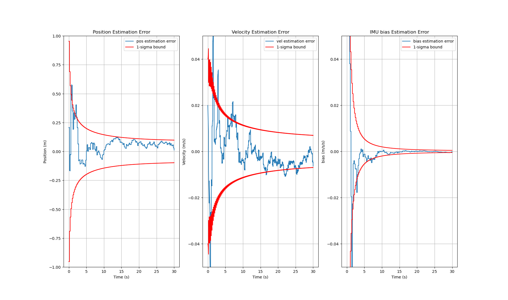
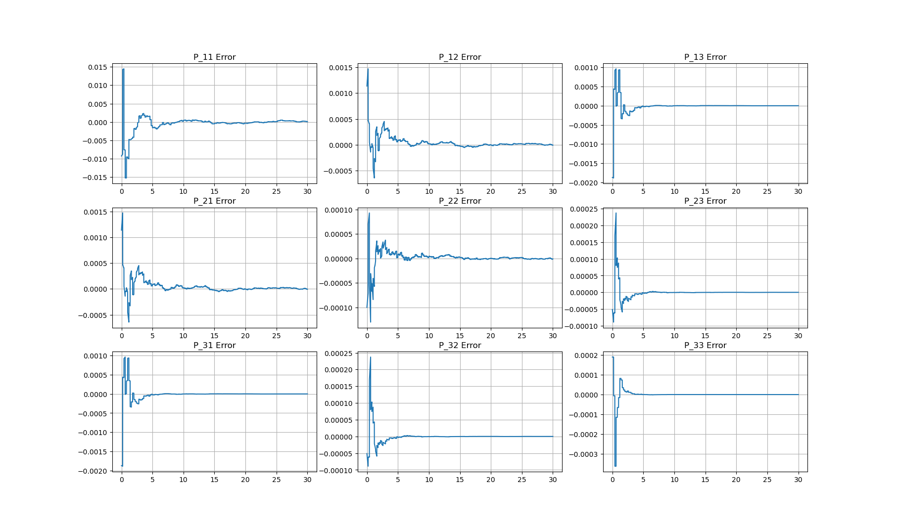

# 271A Kalman Filter Project Report

## Abstract

This report presents the implementation and analysis of a Kalman Filter designed for Calibration of an Accelerometer (IMU) Using GPS Measurements. We consider a vehicle accelerates in one dimension in an inertial frame, with the acceleration profile of

$$
a(t) = 10sin(\omega t)
$$

where $\omega = 0.2 rad/s$.

We have an IMU that measures the acceleration at a sampling frequency of 200Hz. The IMU is modeled as

$$
a_c(t_j) = a(t_j) + b_a + w(t_j)
$$

where $b_a$ is the bias and has apriori statistics $b_a \sim N(0, 0.01 (m/s^2)^2)$, $w$ is the IMU measurement noise and is modeled as additive white Gaussian noise with zero mean and variance $W=0.0004 (m/s^2)^2$

We have a GPS that measures position and velocity at a sampling frequency of 5Hz. The GPS is modeled as

$$
z_p(t_j) = p(t_j) + \eta _p(t_j)\\
z_v(t_j) = v(t_j) + \eta _v(t_j)
$$

where $\eta _p$ and $\eta _v$ are the GPS position and velocity measurement noise, modeled as independent additive white Gaussian noise

$$
\left[\begin{array}{ccc}
\eta _p\\
\eta _v
\end{array}\right]
\sim N(
\left[\begin{array}{ccc}
0\\
0 
\end{array}\right], 
V_{gps} = 
\left[\begin{array}{ccc}
1m^2 & 0\\
0 & (0.04m/s)^2
\end{array}\right]
)
$$

The initial position and velocity has apriori statistics $p_0 \sim N(0m, (10m)^2)$, $v_0 \sim N(100 m/s, (1m/s)^2)$.

Simulation results demonstrate the kalman filter's ability to converge the estimated state to the true state and converge the error variance matrix to the true state error variance matrix.

## Theory

### System Modeling
We want to have our state to be independent of the acceleration profile, such that this filter will perform the same way independent from the actual acceleration of the vehicle.

We model our IMU states as:

$$
a_c(t_k) = a(t_k) + b_a + w(t_k)\\
v_c(t_{k+1}) = v_c(t_k) + a_c(t_k)\Delta t\\
p_c(t_{t_k+1}) = p_c(t_k) + v_c(t_k)\Delta t + a_c(t_k)\frac{\Delta t^2}{2}
$$

We model our true states in discreate time with Euler integration as:

$$
v_E(t_{k+1}) = v_E(t_k) + a(t_k)\Delta t\\
p_e(t_{k+1}) = p_E(t_k) + v_E(t_k)\Delta t + a(t_k)\frac{\Delta t^2}{2}
$$
- Note: It is assumed that the Euler integrated states are close enough to the actual true states from integrating the continuous acceleration profile.

By subtracting the pos and vel in the IMU model from the true states model, we get:

$$
\delta p_E = p_E - p_c\\
\delta v_E = v_E - v_c\\
\delta p_E(t_{k+1}) = \delta p_E(t_k) - \delta v_E(t_k)\Delta t - b_a\frac{\Delta t^2}{2} - w(t_k)\frac{\Delta t^2}{2}\\
\delta v_E(t_{k+1}) = \delta v_E(t_k) - b_a\Delta t - w\Delta t
$$

Let us have a new state
$$
\delta x = [\delta p_E, \delta v_E, b_a]^T\\
$$

We can model our system with the new state as

$$
\delta x(t_{k+1}) = \Phi \delta x(t_k) + \Gamma w(t_k)\\
\Phi = 
\left[\begin{array}{ccc}
1 & \Delta t & -\frac{\Delta t^2}{2}\\
0 & 1 & -\Delta t\\
0 & 0 & 1
\end{array}\right],\
\Gamma = 
\left[\begin{array}{ccc}
-\frac{\Delta t^2}{2}\\
-\Delta t\\
0
\end{array}\right]
$$

Our GPS measurement equation can also be updated as:

$$
\delta z = H\delta x + \eta\\
\delta z = [\delta z_p, \delta z_v]^T,\ \eta = [\eta _p, \eta _v]^T,\
H = 
\left[\begin{array}{ccc}
1 & 0 & 0\\
0 & 1 & 0
\end{array}\right]\\
\delta z_p = z_p - p_c\\
\delta z_v = z_v - v_c
$$

### Kalman Filter Algorithm
From the System above that is independent from the acceleration profile, we can implement Kalman Filter Algorithm.

- Initialize true states based on apirori statistics of the states. Initial state prediction will be the expected values of the states from the apriori statistics. Initial apriori error variance will be the state variances from the apriori statistics.

- Begin loop:
   - Aposteriori estimation for $t_k$
      - If measurement obtained
      $$
      P_k = M_k - M_kH^T(HM_kH^T + V_{gps})^{-1}HM_k\\
      K_k = P_kH^TV^{-1}\\
      r = \delta z - H\delta x_{predicted}\ (residual)\\
      \delta x_{estimate} = \delta x_{predicted} + K_k\ r
      $$

      - If measurement not obtained:
      $$
      P_k = M_k\\
      \delta x_{estimate} = \delta x_{predicted}
      $$

   - Apriori prediction for $t_{k+1}$:
   $$
   \delta x_{predicted} = \Phi \delta x_{estimate}\\
   M_k = \Phi P_k\Phi ^T + \Gamma W\Gamma^T
   $$

## Results

### One Realization Results
 |
:--:|
*Estimation Error Plot for 1 Realization* |

 |
:--:|
*P Error Plot for 1 Realization* |

### Key Findings

1. **Position and Velocity Estimation Errors:**
   The errors for position and velocity consistently converged to zero, as shown in the figures. The 1-sigma bounds derived from the covariance matrix accurately captured the estimation uncertainty.

2. **Bias Estimation:**
   The filter successfully tracked the IMU bias over time, demonstrating its adaptability.

3. **Residual Analysis:**
   Residuals were uncorrelated, validating the filter’s assumptions.

4. **Orthogonality:**
   The orthogonality between estimation errors and the state estimates was confirmed, highlighting the filter’s optimality.

## Analysis

The Kalman Filter’s performance was assessed using several metrics:

- **Error Dynamics:** The error in position and velocity decreased exponentially, aligning with theoretical expectations.
- **Covariance Consistency:** The estimated covariance bounds encompassed the true errors, indicating appropriate tuning of process and measurement noise parameters.
- **Residual Statistics:** Residuals followed Gaussian distributions with zero mean, reinforcing the validity of the noise assumptions.

Challenges observed included sensitivity to initial conditions and noise statistics. Robustness to parameter misestimation remains an area for further investigation.

## Conclusion

The implemented Kalman Filter effectively estimated position, velocity, and bias for a single-axis motion system. Simulation results verified the filter’s accuracy and theoretical consistency. Future work may extend this implementation to multi-dimensional motion and incorporate adaptive noise modeling for enhanced robustness.

